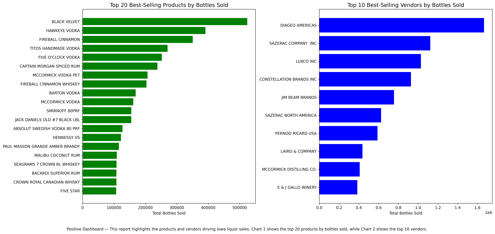
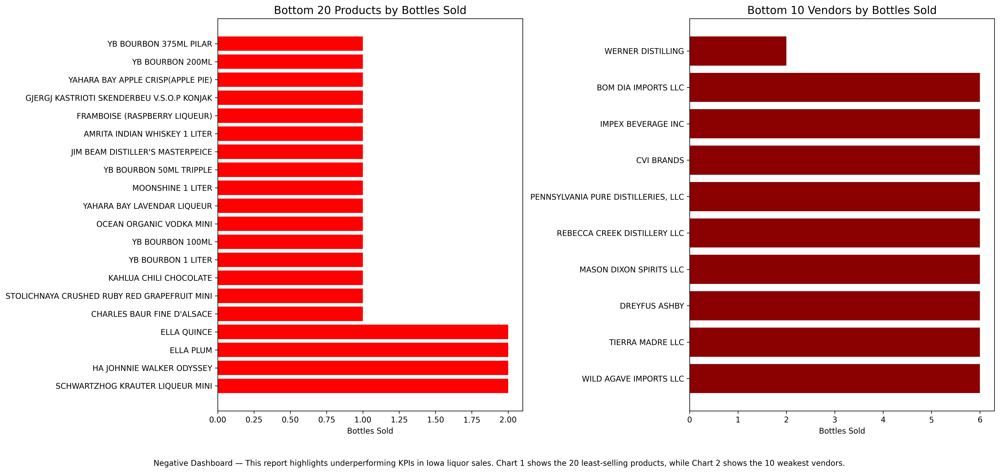

# INFO 526 — Data Analysis and Visualization  
## Assignment 5: Dashboard Reports — Iowa Liquor Sales

### Course
INFO 526 — Data Analysis and Visualization  
Master’s in MIS/ML program, University of Arizona  

---

### 🎯 Objective
To create **static dashboard reports** that summarize KPIs for Iowa liquor sales using the `Smaller_Iowa_Liquor_Sales.csv` dataset.  
The goal is to help a fictional distillery decide which alcohol products to prioritize for maximizing sales and which to avoid due to poor performance.  

Each dashboard presents **two graphics side by side** with captions to provide a coherent narrative.  

---

### Methods
1. **Data Cleaning**  
   - Dropped unnecessary location columns (`Address, City, Zip.Code, County`).  
   - Converted `Date` to datetime.  
   - Removed rows with missing `Category.Name`.  
   - Standardized column names (e.g., `Category.Name` → `Category_Name`).  
   - Converted key string columns (`Category_Name, Vendor_Name, Item_Description`) to categorical type.  
   - Ensured numeric columns are positive and properly typed.  

2. **Dashboard Construction**  
   - **Positive Dashboard:** Highlights best-performing products and vendors.  
   - **Negative Dashboard:** Highlights underperforming products and vendors.  
   - Each dashboard contains **two charts** side by side with a narrative caption.  

---

### Deliverables

#### Positive Dashboard
- **Chart 1:** Top 20 Best-Selling Products (by bottles sold).  
- **Chart 2:** Top 10 Best-Selling Vendors (by bottles sold).  
- **Narrative:** Shows the strongest opportunities for the distillery, identifying both leading products and the vendors driving sales growth.  



---

#### Negative Dashboard
- **Chart 1:** Bottom 20 Least-Selling Products (by bottles sold).  
- **Chart 2:** Bottom 10 Weakest Vendors (by bottles sold).  
- **Narrative:** Identifies products and suppliers that contribute minimally to sales and should not be prioritized by the distillery.  



---

### Repo Structure
```

data-analysis-visualization-assignment-5/
├── .gitignore
├── Dataset/
│   └── Smaller_Iowa_Liquor_Sales.csv
├── README.md
├── notebooks/
│   ├── Negative_Dashboard.png
│   ├── Positive_Dashboard.png
│   └── Week_6_Graded_Assessment_5.ipynb
└── requirements.txt

```

---

### Dataset Instructions

The Iowa Liquor Sales dataset (`Smaller_Iowa_Liquor_Sales.csv`) is **too large to host on GitHub** (174 MB exceeds the 100 MB limit).

To run the analysis:

1. **Download the dataset** from the course materials or the official Iowa data portal (if provided by the instructor).
2. Place the file in the following location in your repo:

```
Dataset/Smaller_Iowa_Liquor_Sales.csv
```


3. Open and run the Jupyter notebook `Week_6_Graded_Assessment_5.ipynb` to regenerate the dashboards.

---


### Key Insights

* **Positive KPIs:** Whiskey, Vodka, and Rum categories dominate sales, with top vendors like Jim Beam and Diageo driving large volumes.
* **Negative KPIs:** Certain niche products and vendors contribute negligible sales and should be avoided to optimize production.

---
